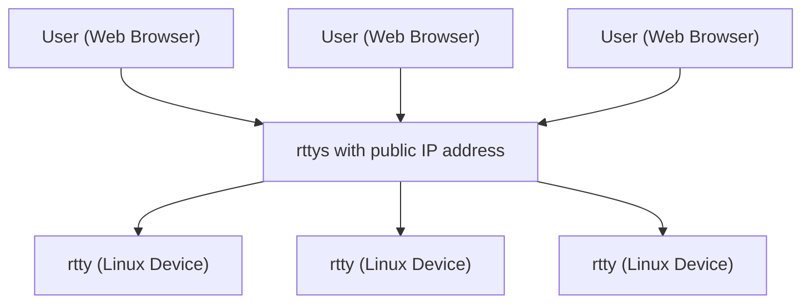

# rtty ([中文](/README_ZH.md)) - Access your device's terminal from anywhere via the web

**Official Website:** https://rttys.net/

**This project is officially supported by [GL.iNet](https://www.gl-inet.com).**

[1]: https://img.shields.io/badge/license-MIT-brightgreen.svg?style=plastic
[2]: /LICENSE
[3]: https://img.shields.io/badge/PRs-welcome-brightgreen.svg?style=plastic
[4]: https://github.com/zhaojh329/rtty/pulls
[5]: https://img.shields.io/badge/Issues-welcome-brightgreen.svg?style=plastic
[6]: https://github.com/zhaojh329/rtty/issues/new
[7]: https://img.shields.io/badge/release-9.0.0-blue.svg?style=plastic
[8]: https://github.com/zhaojh329/rtty/releases
[9]: https://github.com/zhaojh329/rtty/workflows/build/badge.svg
[10]: https://raw.githubusercontent.com/CodePhiliaX/resource-trusteeship/main/readmex.svg
[11]: https://readmex.com/zhaojh329/rtty
[12]: https://deepwiki.com/badge.svg
[13]: https://deepwiki.com/zhaojh329/rtty

[![license][1]][2]
[![PRs Welcome][3]][4]
[![Issue Welcome][5]][6]
[![Release Version][7]][8]
![Build Status][9]
[![ReadmeX][10]][11]
[![Ask DeepWiki][12]][13]

[Xterm.js]: https://github.com/xtermjs/xterm.js
[libev]: http://software.schmorp.de/pkg/libev.html
[openssl]: https://github.com/openssl/openssl
[mbedtls(polarssl)]: https://github.com/ARMmbed/mbedtls
[CyaSSl(wolfssl)]: https://github.com/wolfSSL/wolfssl
[vue]: https://github.com/vuejs/vue
[server]: https://github.com/zhaojh329/rttys

## Architecture

## Overview

rtty is a powerful remote terminal solution composed of a client and a [server]. The client is written in pure C for optimal performance and minimal footprint. The [server] is implemented in Go with a modern frontend built using [Vue].

Access your device's terminal from anywhere via a web browser. Distinguish between different devices using unique device IDs.

rtty is exceptionally well-suited for remote maintenance of thousands of Linux devices deployed worldwide, making it an ideal choice for organizations managing distributed infrastructure.

## Key Features

### 🚀 **Lightweight & Efficient**
- **Minimal footprint**: Client written in pure C, perfect for embedded Linux
  - **Without SSL**: rtty (32KB) + libev (56KB)
  - **With SSL**: + libmbedtls (88KB) + libmbedcrypto (241KB) + libmbedx509 (48KB)

### 🔐 **Security**
- **Multiple SSL backends**: [OpenSSL], [mbedtls(polarssl)], [CyaSSl(wolfssl)]
- **mTLS support** for mutual authentication

### 🌐 **Advanced Remote Management**
- **Batch command execution** across multiple devices remotely
- **Device identification** based on unique device IDs
- **HTTP Proxy support** for accessing device web interfaces

### 📁 **File Management**
- **Seamless file transfer**: Convenient upload and download capabilities
- **Web-based interface** for intuitive file operations

### 💻 **Modern Terminal Experience**
- **Full-featured terminal** powered by [Xterm.js]
- **Browser-based access** from anywhere

### ⚡ **Deployment & Usability**
- **Simple deployment** process
- **Easy to use** interface
- **Cross-platform compatibility**

## Production Users

Trusted by leading technology companies:

- **[GL.iNet](https://www.gl-inet.com/)**
- **[Yunlianxin Technology](http://www.iyunlink.com/)**
- **[One IOT World](https://www.oneiotworld.com/)**
- **[bitswrt Communication Technology](http://bitswrt.com/)**
- **[Guangzhou Lingpai Technology](https://linkpi.cn/)**
- *...and many more*

## Client Dependencies

### Required
- **[libev]** - High-performance event loop library

### Optional (for SSL support)
Choose one of the following SSL libraries:
- **[mbedtls(polarssl)]** - Lightweight SSL/TLS library
- **[CyaSSl(wolfssl)]** - Embedded SSL/TLS library
- **[openssl]** - Full-featured SSL/TLS toolkit

## ⭐ Star History

## 🤝 Contributing

Help us make [rtty](https://github.com/zhaojh329/rtty) even better!

See the [CONTRIBUTING.md](https://github.com/zhaojh329/rtty/blob/master/CONTRIBUTING.md) file for detailed guidelines on how to contribute to this project.