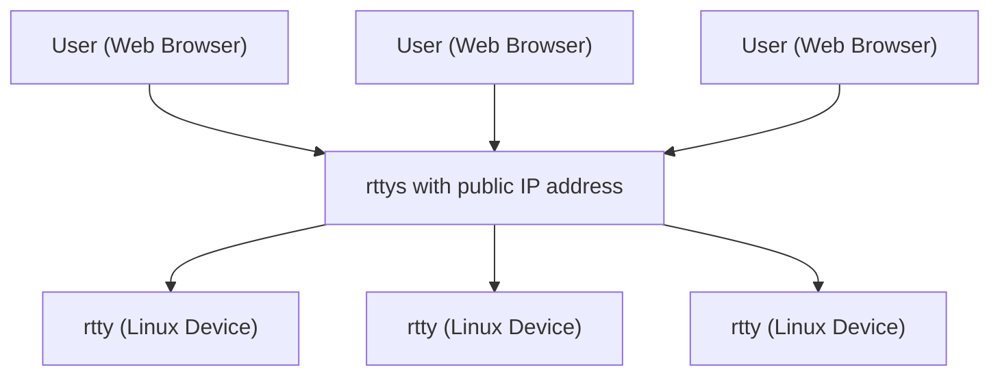

# rtty ([中文](/README_ZH.md)) - Access your device from anywhere via the web

**Official Website:** https://rttys.net/

**This project is officially supported by [GL.iNet](https://www.gl-inet.com).**

[1]: https://img.shields.io/badge/license-MIT-brightgreen.svg?style=plastic
[2]: /LICENSE
[3]: https://img.shields.io/badge/PRs-welcome-brightgreen.svg?style=plastic
[4]: https://github.com/zhaojh329/rtty/pulls
[5]: https://img.shields.io/badge/Issues-welcome-brightgreen.svg?style=plastic
[6]: https://github.com/zhaojh329/rtty/issues/new
[7]: https://img.shields.io/badge/release-9.0.1-blue.svg?style=plastic
[8]: https://github.com/zhaojh329/rtty/releases
[9]: https://github.com/zhaojh329/rtty/workflows/build/badge.svg
[10]: https://raw.githubusercontent.com/CodePhiliaX/resource-trusteeship/main/readmex.svg
[11]: https://readmex.com/zhaojh329/rtty
[12]: https://deepwiki.com/badge.svg
[13]: https://deepwiki.com/zhaojh329/rtty
[14]: https://img.shields.io/github/downloads/zhaojh329/rtty/total

[![license][1]][2]
[![PRs Welcome][3]][4]
[![Issue Welcome][5]][6]
[![Release Version][7]][8]
![Build Status][9]
![Downloads][14]
[![ReadmeX][10]][11]
[![Ask DeepWiki][12]][13]

[Xterm.js]: https://github.com/xtermjs/xterm.js
[libev]: http://software.schmorp.de/pkg/libev.html
[openssl]: https://github.com/openssl/openssl
[mbedtls(polarssl)]: https://github.com/ARMmbed/mbedtls
[CyaSSl(wolfssl)]: https://github.com/wolfSSL/wolfssl
[vue]: https://github.com/vuejs/vue
[server]: https://github.com/zhaojh329/rttys

## Architecture

## Overview

rtty is a powerful remote terminal solution composed of clients and a [server].

**Client Implementations:**
- **C Client:** Ultra-lightweight, designed for embedded Linux and resource-constrained devices.
- **Go Client:** Easy cross-platform compilation, suitable for rapid integration and cloud-native/container environments.

The server is implemented in Go, with a modern frontend built using [Vue].

You can access your device from anywhere via a web browser, and manage devices using unique device IDs.

rtty is ideal for remote maintenance and management of large-scale distributed Linux devices, making it a great choice for enterprise operations.

**Go client repository:** [https://github.com/zhaojh329/rtty-go](https://github.com/zhaojh329/rtty-go)

## Key Features

### 🚀 **Multi-language Client Options**
- **C Client:**
  - Ultra-lightweight, designed for embedded Linux and resource-constrained devices
  - Minimal footprint (without SSL: rtty 32KB + libev 56KB; with SSL: + libmbedtls 88KB + libmbedcrypto 241KB + libmbedx509 48KB)
  - Multiple SSL backends (OpenSSL, mbedtls, CyaSSl/wolfssl)
  - mTLS support for mutual authentication

- **Go Client:**
  - Easy cross-platform compilation, suitable for rapid integration and cloud/container environments
  - Minimal dependencies, simple deployment
  - It has the same functions as the C client and is fully compatible.

### 🔐 **Security**
- Multiple SSL backends and mutual authentication for secure data transfer

### 🌐 **Advanced Remote Management**
- Batch command execution across multiple devices
- Device identification using unique device IDs
- HTTP Proxy support for accessing device web interfaces

### 📁 **File Management**
- Seamless file transfer: convenient upload and download
- Web-based interface for intuitive file operations

### 💻 **Modern Terminal Experience**
- Full-featured terminal powered by [Xterm.js]
- Browser-based access from anywhere
- Virtual keyboard support for touch devices
- Window splitting for multi-session and multitasking

### ⚡ **Deployment & Compatibility**
- Simple deployment and quick setup
- Easy-to-use interface
- Cross-platform compatibility

### ⚡ **Deployment & Usability**
- **Simple deployment** process
- **Easy to use** interface
- **Cross-platform compatibility**

## Production Users

Trusted by leading technology companies:

- **[GL.iNet](https://www.gl-inet.com/)**
- **[Yunlianxin Technology](http://www.iyunlink.com/)**
- **[One IOT World](https://www.oneiotworld.com/)**
- **[bitswrt Communication Technology](http://bitswrt.com/)**
- **[Guangzhou Lingpai Technology](https://linkpi.cn/)**
- *...and many more*

## Client Dependencies

### C Client Dependencies
- **Required:**
  - [libev] - High-performance event loop library
- **Optional (for SSL support):**
  - [mbedtls(polarssl)] - Lightweight SSL/TLS library
  - [CyaSSl(wolfssl)] - Embedded SSL/TLS library
  - [openssl] - Full-featured SSL/TLS toolkit

### Go Client Dependencies
- No extra dependencies. Pure Go build and runtime.

## ⭐ Star History

## 🤝 Contributing

Help us make [rtty](https://github.com/zhaojh329/rtty) even better!

See the [CONTRIBUTING.md](https://github.com/zhaojh329/rtty/blob/master/CONTRIBUTING.md) file for detailed guidelines on how to contribute to this project.
