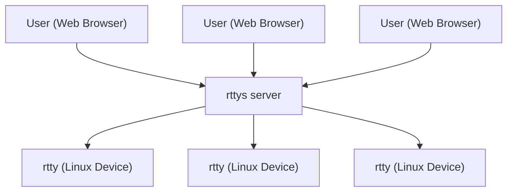

# rtty ([中文](/README_ZH.md)) - Access your device from anywhere via the web

**This project is officially supported by [GL.iNet](https://www.gl-inet.com).**

[1]: https://img.shields.io/badge/license-MIT-brightgreen.svg?style=plastic
[2]: /LICENSE
[3]: https://img.shields.io/badge/PRs-welcome-brightgreen.svg?style=plastic
[4]: https://github.com/zhaojh329/rtty/pulls
[5]: https://img.shields.io/badge/Issues-welcome-brightgreen.svg?style=plastic
[6]: https://github.com/zhaojh329/rtty/issues/new
[7]: https://img.shields.io/badge/release-9.1.0-blue.svg?style=plastic
[8]: https://github.com/zhaojh329/rtty/releases
[9]: https://github.com/zhaojh329/rtty/workflows/build/badge.svg
[14]: https://img.shields.io/github/downloads/zhaojh329/rtty/total

[![license][1]][2]
[![PRs Welcome][3]][4]
[![Issue Welcome][5]][6]
[![Release Version][7]][8]
![Build Status][9]
![Downloads][14]

[Xterm.js]: https://github.com/xtermjs/xterm.js
[libev]: http://software.schmorp.de/pkg/libev.html
[openssl]: https://github.com/openssl/openssl
[mbedtls(polarssl)]: https://github.com/ARMmbed/mbedtls
[CyaSSl(wolfssl)]: https://github.com/wolfSSL/wolfssl
[vue]: https://github.com/vuejs/vue
[server]: https://github.com/zhaojh329/rttys

**[Project website](https://zhaojh329.github.io/rtty/#/) · [Installation & usage guide](https://zhaojh329.github.io/rtty/#/docs)**

## Architecture

```mermaid
flowchart TB
s["rttys server"]
u1["User (Web Browser)"] --> s
u2["User (Web Browser)"] --> s
u3["User (Web Browser)"] --> s
s --> c1["rtty (Linux Device)"]
s --> c2["rtty (Linux Device)"]
s --> c3["rtty (Linux Device)"]
```

## Overview

rtty is a remote access solution composed of device clients and the [rttys server][server].
This repository contains the C client; rttys provides the web interface and relays connections to devices.
Open a terminal, transfer files, and access device services through a central server.

**Client Implementations:**

- **C Client:** Ultra-lightweight, designed for embedded Linux and resource-constrained devices.
- **Go Client:** Easy cross-platform compilation, suitable for rapid integration and deployment.

The server is implemented in Go, with a modern frontend built using [Vue].

Both browsers and device clients must be able to reach the server. Clients initiate connections to it, so devices behind NAT do not need public IP addresses or inbound port forwarding.
Access devices through your browser and identify them by device ID and group.

Use rtty to maintain OpenWrt routers, troubleshoot embedded Linux gateways, or manage distributed Linux devices remotely.

**Go client repository:** [https://github.com/zhaojh329/rtty-go](https://github.com/zhaojh329/rtty-go)

## Key Features

### 🚀 **Multi-language Client Options**

- **C Client:**
  - Ultra-lightweight, designed for embedded Linux and resource-constrained devices
  - Multiple SSL backends (OpenSSL, mbedtls, CyaSSl/wolfssl)
  - mTLS support for mutual authentication

- **Go Client:**
  - Easy cross-platform compilation, suitable for rapid integration and deployment
  - Dependencies managed by the Go toolchain for straightforward builds and deployment
  - Connects to the same rttys server as the C client

### 🔐 **Security**

- TLS encryption for connections between device clients and rttys
- Optional mutual TLS (mTLS) for certificate-based client authentication

### 🌐 **Advanced Remote Management**

- Batch command execution across multiple devices
- Device identification and organization using IDs and groups
- HTTP proxy support for accessing device web interfaces
- TCP port forwarding for accessing TCP services through connected devices

### 📁 **File Management**

- Upload and download files through the web interface

### 💻 **Modern Terminal Experience**

- Full-featured terminal powered by [Xterm.js]
- Browser-based access from anywhere
- Virtual keyboard support for touch devices
- Window splitting for multi-session and multitasking
- Serial terminal forwarding support

### ⚡ **Deployment & Compatibility**

- Simple deployment: configure the server and connect your devices to get started
- Manage devices, access terminals, and transfer files through the web interface
- Clients for Linux and OpenWrt environments

## Production Users

Trusted by leading technology companies:

- **[GL.iNet](https://www.gl-inet.com/)**
- **[Yunlianxin Technology](http://www.iyunlink.com/)**
- **[One IOT World](https://www.oneiotworld.com/)**
- **[bitswrt Communication Technology](http://bitswrt.com/)**
- **[Guangzhou Lingpai Technology](https://linkpi.cn/)**
- *...and many more*

## Client Dependencies

### C Client Dependencies

- **Required:**
  - [libev] - High-performance event loop library
  - [inih](https://github.com/benhoyt/inih) - Lightweight INI parser for loading rtty config file
- **Optional (for SSL support):**
  - [mbedtls(polarssl)] - Lightweight SSL/TLS library
  - [CyaSSl(wolfssl)] - Embedded SSL/TLS library
  - [openssl] - Full-featured SSL/TLS toolkit

### Go Client Dependencies

- Go module dependencies are managed by the Go toolchain.

## ⭐ Star History

## 🤝 Contributing

Help us make [rtty](https://github.com/zhaojh329/rtty) even better!

See the [CONTRIBUTING.md](https://github.com/zhaojh329/rtty/blob/master/CONTRIBUTING.md) file for detailed guidelines on how to contribute to this project.

## ❤️ [Donation](https://zhaojh329.github.io/zhaojh329/)
