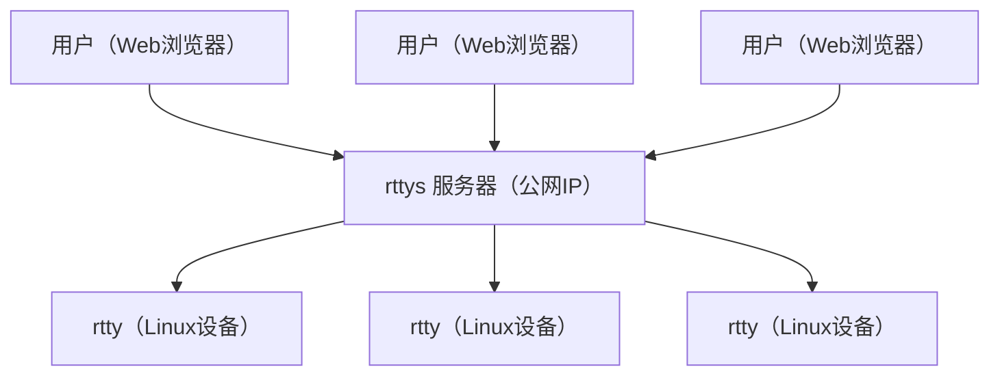

# rtty - 在任何地方通过Web访问您的设备

**官方网站：** https://rttys.net/

**本项目由 [GL.iNet](https://www.gl-inet.com) 官方支持。**

[1]: https://img.shields.io/badge/开源协议-MIT-brightgreen.svg?style=plastic
[2]: /LICENSE
[3]: https://img.shields.io/badge/提交代码-欢迎-brightgreen.svg?style=plastic
[4]: https://github.com/zhaojh329/rtty/pulls
[5]: https://img.shields.io/badge/提问-欢迎-brightgreen.svg?style=plastic
[6]: https://github.com/zhaojh329/rtty/issues/new
[7]: https://img.shields.io/badge/发布版本-9.0.1-blue.svg?style=plastic
[8]: https://github.com/zhaojh329/rtty/releases
[9]: https://github.com/zhaojh329/rtty/workflows/build/badge.svg
[10]: https://raw.githubusercontent.com/CodePhiliaX/resource-trusteeship/main/readmex.svg
[11]: https://readmex.com/zhaojh329/rtty
[12]: https://deepwiki.com/badge.svg
[13]: https://deepwiki.com/zhaojh329/rtty
[14]: https://img.shields.io/badge/技术交流群-点击加入：153530783-brightgreen.svg
[15]: https://jq.qq.com/?_wv=1027&k=5PKxbTV
[16]: https://img.shields.io/github/downloads/zhaojh329/rtty/total

[![license][1]][2]
[![PRs Welcome][3]][4]
[![Issue Welcome][5]][6]
[![Release Version][7]][8]
![Build Status][9]
![Downloads][16]
[![ReadmeX][10]][11]
[![Ask DeepWiki][12]][13]

[![Chinese Chat][14]][15]

[Xterm.js]: https://github.com/xtermjs/xterm.js
[libev]: http://software.schmorp.de/pkg/libev.html
[openssl]: https://github.com/openssl/openssl
[mbedtls(polarssl)]: https://github.com/ARMmbed/mbedtls
[CyaSSl(wolfssl)]: https://github.com/wolfSSL/wolfssl
[vue]: https://github.com/vuejs/vue
[服务端]: https://github.com/zhaojh329/rttys

## 系统架构

## 产品概述

rtty 是一套强大的远程终端解决方案，由客户端和[服务端]组成。客户端现已支持两种实现：

- **C 语言客户端**：极致轻量，专为嵌入式Linux和资源受限设备设计。
- **Go 语言客户端**：易于跨平台编译，适合快速集成和二次开发。

服务端采用 Go 语言实现，前端界面基于 [Vue] 框架构建。

通过 Web 浏览器，您可以随时随地访问设备，并通过唯一设备 ID 进行设备区分和管理。

rtty 非常适合远程维护和管理大规模分布式Linux设备，是企业级设备运维的理想选择。

**Go 客户端仓库地址：** [https://github.com/zhaojh329/rtty-go](https://github.com/zhaojh329/rtty-go)

## 核心特性

### 🚀 **多语言客户端选择**
- **C 语言客户端**：
  - 极致轻量，专为嵌入式Linux和资源受限设备设计
  - 占用极小（无SSL版本：rtty 32KB + libev 56KB；SSL版本：+ libmbedtls 88KB + libmbedcrypto 241KB + libmbedx509 48KB）
  - 支持多种 SSL 后端（OpenSSL、mbedtls、CyaSSl/wolfssl）
  - 支持双向 SSL 认证（mTLS）

- **Go 语言客户端**：
  - 易于跨平台编译，适合快速集成和二次开发
  - 依赖少，部署简单，适合云原生和容器环境
  - 与 C 客户端功能一致，完全兼容

### 🔐 **安全**
- 支持多种SSL后端和双向认证，保障数据安全

### 🌐 **高级远程管理**
- 批量命令执行，跨多设备远程批量操作
- 设备 ID 识别，基于唯一设备 ID 进行设备区分
- HTTP 代理支持，访问设备的 Web 管理界面

### 📁 **文件管理**
- 无缝文件传输，便捷的上传和下载功能
- Web 界面操作，直观的文件管理体验

### 💻 **现代终端体验**
- 全功能终端，基于 [Xterm.js] 的完整终端体验
- 浏览器访问，随时随地的设备访问能力
- 虚拟键盘支持，触摸设备的虚拟键盘支持
- 支持窗口分割，便于多会话和多任务操作

### ⚡ **部署与兼容性**
- 简单部署，快速搭建过程
- 易于使用，直观的操作界面
- 跨平台兼容，支持多种系统和环境

## 生产用户

已获得知名技术企业信赖：

- **[深圳市广联智通科技有限公司](https://www.gl-inet.com/)**
- **[深圳市云联芯科技有限公司](http://www.iyunlink.com/)**
- **[成都四海万联科技有限公司](https://www.oneiotworld.com/)**
- **[bitswrt Communication Technology](http://bitswrt.com/)**
- **[广州灵派科技有限公司](https://linkpi.cn/)**
- *...以及更多企业*

## 客户端依赖

### C 语言客户端依赖
- **必需组件**
  - [libev] - 高性能事件循环库
- **可选组件（SSL支持）**
  - [mbedtls(polarssl)] - 轻量级SSL/TLS库
  - [CyaSSl(wolfssl)] - 嵌入式SSL/TLS库
  - [openssl] - 全功能SSL/TLS工具包

### Go 语言客户端依赖
- 无需额外依赖，编译和运行均为纯 Go 环境。

## ⭐ Star历史

## 🤝 贡献代码

欢迎帮助[rtty](https://github.com/zhaojh329/rtty)变得更加完善！

如果您想为rtty贡献代码，请参考[CONTRIBUTING_ZH.md](/CONTRIBUTING_ZH.md)文件，了解详细的贡献指南。

## 推荐学习

**强烈推荐佐大的OpenWrt培训班**

想学习OpenWrt开发，但是摸不着门道？自学没毅力？基础太差？怕太难学不会？快来参加<跟着佐大学OpenWrt开发入门培训班>，佐大助你能学有所成！

培训班报名地址：http://forgotfun.org/2018/04/openwrt-training-2018.html
