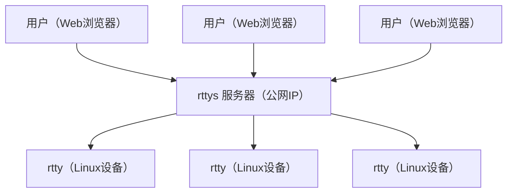

# rtty - 在任何地方通过Web访问您的设备终端

**官方网站：** https://rttys.net/

**本项目由 [GL.iNet](https://www.gl-inet.com) 官方支持。**

[1]: https://img.shields.io/badge/开源协议-MIT-brightgreen.svg?style=plastic
[2]: /LICENSE
[3]: https://img.shields.io/badge/提交代码-欢迎-brightgreen.svg?style=plastic
[4]: https://github.com/zhaojh329/rtty/pulls
[5]: https://img.shields.io/badge/提问-欢迎-brightgreen.svg?style=plastic
[6]: https://github.com/zhaojh329/rtty/issues/new
[7]: https://img.shields.io/badge/发布版本-9.0.0-blue.svg?style=plastic
[8]: https://github.com/zhaojh329/rtty/releases
[9]: https://github.com/zhaojh329/rtty/workflows/build/badge.svg
[10]: https://raw.githubusercontent.com/CodePhiliaX/resource-trusteeship/main/readmex.svg
[11]: https://readmex.com/zhaojh329/rtty
[12]: https://deepwiki.com/badge.svg
[13]: https://deepwiki.com/zhaojh329/rtty
[14]: https://img.shields.io/badge/技术交流群-点击加入：153530783-brightgreen.svg
[15]: https://jq.qq.com/?_wv=1027&k=5PKxbTV
[16]: https://img.shields.io/github/downloads/zhaojh329/rtty/total

[![license][1]][2]
[![PRs Welcome][3]][4]
[![Issue Welcome][5]][6]
[![Release Version][7]][8]
![Build Status][9]
![Downloads][16]
[![ReadmeX][10]][11]
[![Ask DeepWiki][12]][13]

[![Chinese Chat][14]][15]

[Xterm.js]: https://github.com/xtermjs/xterm.js
[libev]: http://software.schmorp.de/pkg/libev.html
[openssl]: https://github.com/openssl/openssl
[mbedtls(polarssl)]: https://github.com/ARMmbed/mbedtls
[CyaSSl(wolfssl)]: https://github.com/wolfSSL/wolfssl
[vue]: https://github.com/vuejs/vue
[服务端]: https://github.com/zhaojh329/rttys

## 系统架构

## 产品概述

rtty 是一套强大的远程终端解决方案，由客户端和[服务端]组成。客户端采用纯C语言实现，具有极佳的性能和最小的资源占用。[服务端]采用Go语言实现，前端界面基于[Vue]框架构建。

您可以在任何地方通过Web浏览器访问设备终端，通过独特的设备ID来区分和管理不同的设备。

rtty 特别适合远程维护部署在全球各地的成千上万台Linux设备，是企业级分布式设备管理的理想选择。

## 核心特性

### 🚀 **轻量高效**
- **极小占用**：客户端采用纯C语言实现，专为嵌入式Linux优化
  - **无SSL版本**：rtty(32KB) + libev(56KB)
  - **SSL版本**：+ libmbedtls(88KB) + libmbedcrypto(241KB) + libmbedx509(48KB)

### 🔐 **安全**
- **多SSL后端支持**：[OpenSSL]、[mbedtls(polarssl)]、[CyaSSl(wolfssl)]
- **双向SSL认证(mTLS)**：提供相互身份验证

### 🌐 **高级远程管理**
- **批量命令执行**：跨多设备远程批量操作
- **设备ID识别**：基于唯一设备ID进行设备区分
- **HTTP代理支持**：访问设备的Web管理界面

### 📁 **文件管理**
- **无缝文件传输**：便捷的上传和下载功能
- **Web界面操作**：直观的文件管理体验

### 💻 **现代终端体验**
- **全功能终端**：基于[Xterm.js]的完整终端体验
- **浏览器访问**：随时随地的设备访问能力
- **虚拟键盘支持**：触摸设备的虚拟键盘支持

### ⚡ **部署使用**
- **简单部署**：快速搭建过程
- **易于使用**：直观的操作界面
- **跨平台兼容**：广泛的平台支持

## 生产用户

已获得知名技术企业信赖：

- **[深圳市广联智通科技有限公司](https://www.gl-inet.com/)**
- **[深圳市云联芯科技有限公司](http://www.iyunlink.com/)**
- **[成都四海万联科技有限公司](https://www.oneiotworld.com/)**
- **[bitswrt Communication Technology](http://bitswrt.com/)**
- **[广州灵派科技有限公司](https://linkpi.cn/)**
- *...以及更多企业*

## 客户端依赖

### 必需组件
- **[libev]** - 高性能事件循环库

### 可选组件（SSL支持）
选择以下SSL库之一：
- **[mbedtls(polarssl)]** - 轻量级SSL/TLS库
- **[CyaSSl(wolfssl)]** - 嵌入式SSL/TLS库
- **[openssl]** - 全功能SSL/TLS工具包

## ⭐ Star历史

## 🤝 贡献代码

欢迎帮助[rtty](https://github.com/zhaojh329/rtty)变得更加完善！

如果您想为rtty贡献代码，请参考[CONTRIBUTING_ZH.md](/CONTRIBUTING_ZH.md)文件，了解详细的贡献指南。

## 推荐学习

**强烈推荐佐大的OpenWrt培训班**

想学习OpenWrt开发，但是摸不着门道？自学没毅力？基础太差？怕太难学不会？快来参加<跟着佐大学OpenWrt开发入门培训班>，佐大助你能学有所成！

培训班报名地址：http://forgotfun.org/2018/04/openwrt-training-2018.html