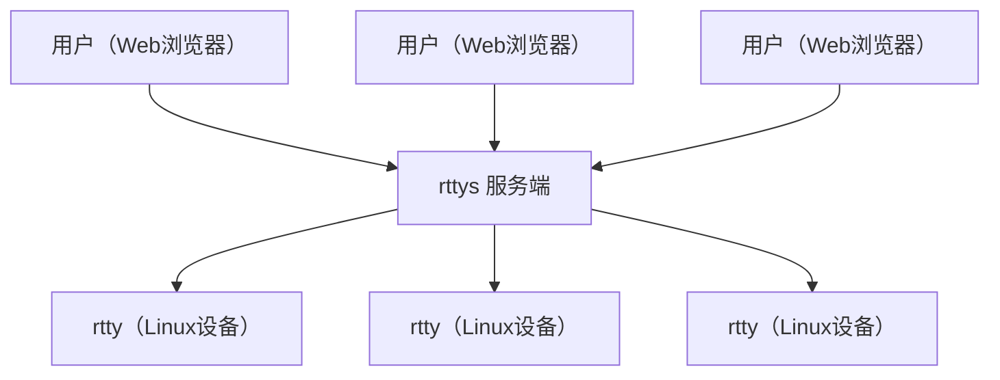

# rtty - 在任何地方通过Web访问您的设备

**本项目由 [GL.iNet](https://www.gl-inet.com) 官方支持。**

[1]: https://img.shields.io/badge/开源协议-MIT-brightgreen.svg?style=plastic
[2]: /LICENSE
[3]: https://img.shields.io/badge/提交代码-欢迎-brightgreen.svg?style=plastic
[4]: https://github.com/zhaojh329/rtty/pulls
[5]: https://img.shields.io/badge/提问-欢迎-brightgreen.svg?style=plastic
[6]: https://github.com/zhaojh329/rtty/issues/new
[7]: https://img.shields.io/badge/发布版本-9.1.0-blue.svg?style=plastic
[8]: https://github.com/zhaojh329/rtty/releases
[9]: https://github.com/zhaojh329/rtty/workflows/build/badge.svg
[14]: https://img.shields.io/badge/技术交流群-点击加入：153530783-brightgreen.svg
[15]: https://jq.qq.com/?_wv=1027&k=5PKxbTV
[16]: https://img.shields.io/github/downloads/zhaojh329/rtty/total

[![license][1]][2]
[![PRs Welcome][3]][4]
[![Issue Welcome][5]][6]
[![Release Version][7]][8]
![Build Status][9]
![Downloads][16]

[![Chinese Chat][14]][15]

[Xterm.js]: https://github.com/xtermjs/xterm.js
[libev]: http://software.schmorp.de/pkg/libev.html
[openssl]: https://github.com/openssl/openssl
[mbedtls(polarssl)]: https://github.com/ARMmbed/mbedtls
[CyaSSl(wolfssl)]: https://github.com/wolfSSL/wolfssl
[vue]: https://github.com/vuejs/vue
[服务端]: https://github.com/zhaojh329/rttys

**[项目官网](https://zhaojh329.github.io/rtty/#/) · [安装与使用文档](https://zhaojh329.github.io/rtty/#/docs)**

## 系统架构

```mermaid
flowchart TB
s["rttys 服务端"]
u1["用户（Web浏览器）"] --> s
u2["用户（Web浏览器）"] --> s
u3["用户（Web浏览器）"] --> s
s --> c1["rtty（Linux设备）"]
s --> c2["rtty（Linux设备）"]
s --> c3["rtty（Linux设备）"]
```

## 产品概述

rtty 是一套远程访问解决方案，由设备客户端和 [rttys 服务端][服务端]组成。
本仓库提供 C 语言客户端；rttys 提供 Web 管理界面，并转发到设备的连接。
通过统一的服务端，您可以打开设备终端、传输文件和访问设备服务。客户端支持两种实现：

- **C 语言客户端**：极致轻量，专为嵌入式 Linux 和资源受限设备设计。
- **Go 语言客户端**：易于跨平台编译，适合快速集成和二次开发。

服务端采用 Go 语言实现，前端界面基于 [Vue] 框架构建。

浏览器和设备客户端都需要能够访问服务端。客户端主动发起连接，因此 NAT 后的设备无需公网 IP，也无需配置入站端口转发。
您可以通过浏览器访问设备，并通过设备 ID 和分组进行区分和管理。

rtty 适用于 OpenWrt 路由器远程维护、嵌入式 Linux 网关故障排查，以及分布式 Linux 设备运维。

**Go 客户端仓库地址：** [https://github.com/zhaojh329/rtty-go](https://github.com/zhaojh329/rtty-go)

## 核心特性

### 🚀 **多语言客户端选择**

- **C 语言客户端**：
  - 极致轻量，专为嵌入式 Linux 和资源受限设备设计
  - 支持多种 SSL 后端（OpenSSL、mbedtls、CyaSSl/wolfssl）
  - 支持双向 SSL 认证（mTLS）

- **Go 语言客户端**：
  - 易于跨平台编译，适合快速集成和二次开发
  - 依赖由 Go 工具链管理，便于构建和部署
  - 与 C 客户端连接同一个 rttys 服务端

### 🔐 **安全**

- 支持设备客户端与 rttys 之间的 TLS 加密连接
- 可选双向 TLS 认证（mTLS），通过证书认证客户端

### 🌐 **高级远程管理**

- 跨设备批量执行命令
- 通过设备 ID 和分组区分、管理设备
- HTTP 代理，访问设备的 Web 管理界面
- TCP 端口转发，通过已连接的设备访问 TCP 服务

### 📁 **文件管理**

- 通过 Web 界面上传和下载文件

### 💻 **现代终端体验**

- 基于 [Xterm.js] 的全功能终端
- 通过浏览器随时随地访问设备
- 适用于触摸设备的虚拟键盘
- 支持窗口分割，便于多会话和多任务操作
- 支持串口终端转发

### ⚡ **部署与兼容性**

- 部署简单，配置服务端并接入设备即可使用
- 通过 Web 界面管理设备、访问终端和传输文件
- 客户端适用于 Linux、OpenWrt 等环境

## 生产用户

已获得知名技术企业信赖：

- **[深圳市广联智通科技有限公司](https://www.gl-inet.com/)**
- **[深圳市云联芯科技有限公司](http://www.iyunlink.com/)**
- **[成都四海万联科技有限公司](https://www.oneiotworld.com/)**
- **[bitswrt Communication Technology](http://bitswrt.com/)**
- **[广州灵派科技有限公司](https://linkpi.cn/)**
- *...以及更多企业*

## 客户端依赖

### C 语言客户端依赖

- **必需组件**
  - [libev] - 高性能事件循环库
  - [inih](https://github.com/benhoyt/inih) - 轻量级 INI 解析库，用于加载 rtty 配置文件
- **可选组件（SSL 支持）**
  - [mbedtls(polarssl)] - 轻量级 SSL/TLS 库
  - [CyaSSl(wolfssl)] - 嵌入式 SSL/TLS 库
  - [openssl] - 全功能 SSL/TLS 工具包

### Go 语言客户端依赖

- Go 模块依赖由 Go 工具链管理。

## ⭐ Star历史

## 🤝 贡献代码

欢迎帮助[rtty](https://github.com/zhaojh329/rtty)变得更加完善！

如果您想为rtty贡献代码，请参考[CONTRIBUTING_ZH.md](/CONTRIBUTING_ZH.md)文件，了解详细的贡献指南。

## ❤️ [捐赠](https://zhaojh329.github.io/zhaojh329/)

## 推荐学习

**强烈推荐佐大的OpenWrt培训班**

想学习OpenWrt开发，但是摸不着门道？自学没毅力？基础太差？怕太难学不会？快来参加<跟着佐大学OpenWrt开发入门培训班>，佐大助你能学有所成！

培训班报名地址：http://forgotfun.org/2018/04/openwrt-training-2018.html
